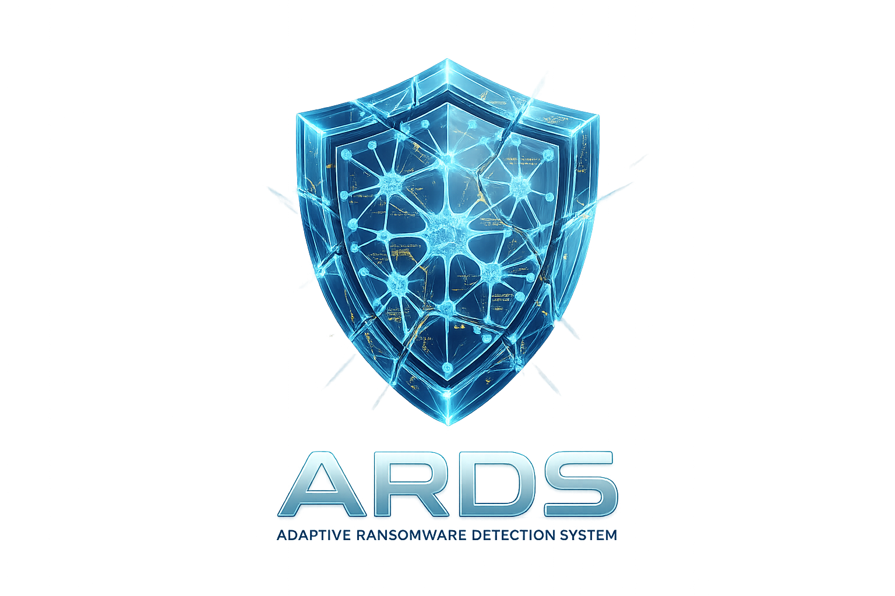
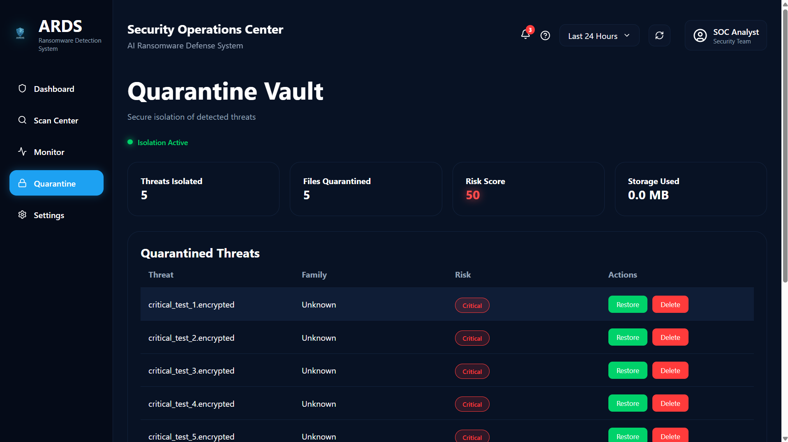
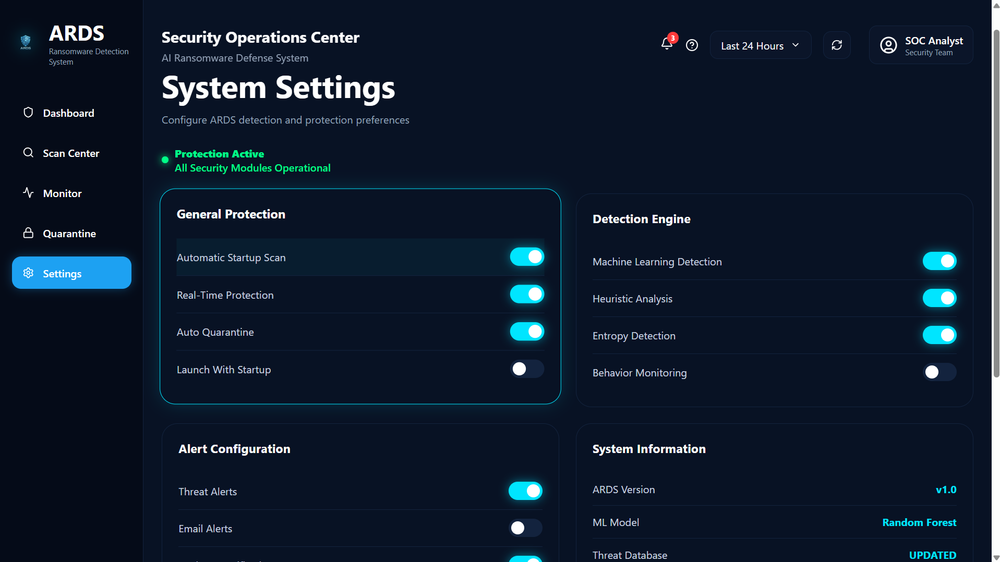

<div align="center">



# 🛡️ Adaptive Ransomware Detection System (ARDS)

### AI-Powered Endpoint Ransomware Detection & Response Platform

<p>

Adaptive Ransomware Detection System (ARDS) is a modern cybersecurity platform designed to detect, analyze, and respond to ransomware attacks using Machine Learning, Behavioral Analysis, Threat Correlation, Risk Assessment, and Automated Response mechanisms.

Rather than relying solely on signature-based detection, ARDS combines multiple independent detection engines to identify ransomware based on its behavior before encryption causes significant damage.

</p>

---


---

## 🚀 Independent Cybersecurity Project

Designed and Developed by

# **Sarthak Panda**

**Second-Year B.Tech Computer Science Student**

Building practical cybersecurity solutions through software engineering, machine learning, and modern web technologies.

</div>

---

# 📖 Why ARDS?

Traditional antivirus software primarily relies on signature-based detection, making it less effective against new, evolving, and previously unseen ransomware variants.

ARDS adopts a **multi-layered detection strategy** by combining Machine Learning, Behavioral Analysis, Entropy Monitoring, Process Analysis, Threat Correlation, and Adaptive Risk Assessment to identify suspicious activity in real time.

Instead of depending on a single indicator of compromise, ARDS correlates multiple behavioral signals before making an automated security decision, reducing false positives while improving ransomware detection capability.

This project was built as an independent cybersecurity initiative to explore modern endpoint protection concepts and demonstrate how intelligent detection pipelines can enhance ransomware defense.


# ✨ Core Capabilities

ARDS combines multiple independent security engines into a unified ransomware detection platform. Each module contributes to the final risk assessment, allowing the system to make intelligent decisions based on correlated behavioral evidence rather than a single indicator.

| Module | Description |
|---------|-------------|
| 🧠 Machine Learning Engine | Classifies files using extracted static features and a trained machine learning model. |
| 📈 Behavioral Analysis Engine | Continuously analyzes runtime behavior for ransomware-like activities. |
| 🔥 Entropy Analysis | Detects abnormal increases in file entropy caused by encryption. |
| ⚡ Burst Activity Detection | Identifies rapid file modifications that commonly occur during ransomware attacks. |
| 🧩 Extension Detection | Detects known ransomware file extensions and suspicious file renaming. |
| 🛡️ Hash Reputation Engine | Compares file hashes against known malicious signatures. |
| ⚙️ Process Monitoring | Observes suspicious processes interacting with protected directories. |
| 🪤 Honeypot Protection | Uses decoy files to detect unauthorized encryption attempts. |
| 🎯 Risk Assessment Engine | Correlates evidence from all detection engines into a unified risk score. |
| 🤖 Decision Engine | Determines the appropriate response based on calculated threat severity. |
| 🔒 Automated Response Engine | Automatically quarantines malicious files and records security events. |
| 🌐 Threat Intelligence | Displays real-time threat information and system security posture. |
| 📊 SOC Dashboard | Provides live visualization of security metrics and detection events. |
| 📍 MITRE ATT&CK Mapping | Maps detected behaviors to MITRE ATT&CK techniques for better threat understanding. |

# 🏗️ System Architecture

ARDS follows a modular security architecture inspired by modern Endpoint Detection and Response (EDR) solutions.

```text
                     User
                       │
                       ▼
              React SOC Dashboard
                       │
              FastAPI REST API
                       │
 ┌────────────────────────────────────────────┐
 │                                            │
 │     Detection & Analysis Layer             │
 │                                            │
 │  • Machine Learning Engine                 │
 │  • Behavioral Analysis                     │
 │  • Entropy Detection                       │
 │  • Burst Detection                         │
 │  • Extension Detection                     │
 │  • Hash Detection                          │
 │  • Process Monitoring                      │
 │  • Honeypot Monitoring                     │
 │                                            │
 └────────────────────────────────────────────┘
                       │
                       ▼
         Threat Correlation & Risk Engine
                       │
                       ▼
             Automated Decision Engine
                       │
                       ▼
             Automated Response Engine
                       │
          ┌────────────┴─────────────┐
          ▼                          ▼
   Quarantine                 Threat Intelligence
          │                          │
          └────────────┬─────────────┘
                       ▼
               Dashboard Telemetry
```

# 📸 Application Preview

The following screenshots demonstrate the major components of ARDS.

> **Note:** These screenshots represent the current development version. The UI continues to evolve with new features and improvements.

---

## 🛡️ Security Operations Center Dashboard

<p align="center">


</p>

Real-time visualization of the system security posture including:

- Security Score
- Detection Engines
- Threat Intelligence
- Threat Activity
- Attack Vector Distribution
- Severity Analysis
- MITRE ATT&CK Mapping
- Recent Alerts

---

## 🔍 Scan Center

<p align="center">


</p>

Features:

- Folder Selection
- Manual Scan
- Live Scan Progress
- Detection Report
- Risk Assessment
- Automatic Quarantine

---

## 📡 Real-Time Monitoring

<p align="center">


</p>

Provides continuous monitoring of protected directories with live event tracking.

---

## 🔒 Quarantine Manager

<p align="center">



</p>

Supports:

- Automatic quarantine
- Restore files
- Delete files
- Threat classification
- Risk information

---

## ⚙️ Settings

<p align="center">



</p>

Allows configuration of:

- Monitoring Paths
- Detection Thresholds
- Quarantine Behavior
- Dashboard Preferences

# 🔄 Detection Workflow

ARDS follows a multi-stage detection pipeline designed to improve ransomware detection accuracy.

```text
                     User Selects Folder
                             │
                             ▼
                    Initial File Scan
                             │
          ┌─────────────────────────────────┐
          │                                 │
          ▼                                 ▼
 Machine Learning                 Static Feature Analysis
          │                                 │
          └──────────────┬──────────────────┘
                         ▼
              Behavioral Analysis Engine
                         │
          ┌──────────────┼──────────────┐
          ▼              ▼              ▼
    Entropy        Process Monitor   Burst Detection
          │              │              │
          └──────────────┼──────────────┘
                         ▼
             Threat Correlation Engine
                         │
                         ▼
                Adaptive Risk Assessment
                         │
                         ▼
                  Decision Engine
                         │
        ┌────────────────┴───────────────┐
        ▼                                ▼
  Safe / Low Risk               High / Critical
                                        │
                                        ▼
                             Automatic Quarantine
                                        │
                                        ▼
                          Dashboard & Alert System
```

# 💻 Technology Stack

| Category | Technology |
|-----------|------------|
| Frontend | React + Vite |
| Styling | CSS3 |
| Backend | FastAPI |
| Language | Python |
| Machine Learning | Scikit-learn |
| Data Processing | Pandas, NumPy |
| Monitoring | Watchdog |
| Charts | Recharts |
| Visualization | React Components |
| Version Control | Git & GitHub |
| Development Environment | VS Code |


# 📁 Project Structure

```text
ARDS
│
├── frontend/                 # React Frontend
│   ├── assets/
│   ├── components/
│   ├── hooks/
│   ├── pages/
│   └── api/
│
├── src/
│   ├── core/
│   ├── detection/
│   ├── incident/
│   ├── knowledge/
│   ├── ml/
│   ├── scanner/
│   ├── services/
│   ├── shared/
│   └── utils/
│
├── models/
├── screenshots/
├── docs/
├── logs/
├── quarantine/
├── restored_files/
│
├── README.md
├── LICENSE
├── CHANGELOG.md
└── requirements.txt
```

# 🚀 Getting Started

Follow these steps to run ARDS locally.

---

## Prerequisites

Make sure the following software is installed:

- Python 3.12+
- Node.js 20+
- npm
- Git

---

## Clone the Repository

```bash
git clone https://github.com/Spgamester/Adaptive-Ransomware-Defense-System.git

cd Adaptive-Ransomware-Defense-System
```

---

## Backend Setup

Create a virtual environment

```bash
python -m venv venv
```

Activate

### Windows

```bash
venv\Scripts\activate
```

### Linux / macOS

```bash
source venv/bin/activate
```

Install dependencies

```bash
pip install -r requirements.txt
```

Run FastAPI

```bash
python api.py
```

Backend will start on

```
http://127.0.0.1:8000
```

---

## Frontend Setup

Open another terminal

```bash
cd frontend
```

Install dependencies

```bash
npm install
```

Start React

```bash
npm run dev
```

Frontend

```
http://localhost:5173
```

---

## Default Workflow

1. Launch Backend
2. Launch Frontend
3. Open Dashboard
4. Select Scan Folder
5. Run Detection
6. Monitor Threats
7. Review Quarantine

# ⚙️ Configuration

ARDS can be configured using the **Settings** page.

Supported configuration options include:

- Monitoring Folder
- Quarantine Folder
- Automatic Quarantine
- Entropy Threshold
- Detection Sensitivity
- Dashboard Refresh Rate
- Threat Monitoring Options

Settings are stored locally using a JSON configuration file.

# 🌐 API Endpoints

| Endpoint | Description |
|----------|-------------|
| `/api/dashboard` | Dashboard statistics |
| `/api/scan` | Manual scan |
| `/api/monitor/start` | Start monitoring |
| `/api/monitor/stop` | Stop monitoring |
| `/api/live-events` | Live security events |
| `/api/alerts` | Recent alerts |
| `/api/quarantine-files` | Quarantine manager |
| `/api/quarantine/restore` | Restore quarantined file |
| `/api/quarantine/delete` | Delete quarantined file |
| `/api/intelligence` | Threat intelligence |
| `/api/settings` | Read settings |
| `/api/settings/save` | Save settings |

# 🛣️ Roadmap

## Version 1.0

- ✅ Multi-engine ransomware detection
- ✅ React SOC Dashboard
- ✅ FastAPI backend
- ✅ Threat Intelligence
- ✅ Behavioral Analysis
- ✅ Machine Learning Detection
- ✅ Quarantine Management
- ✅ Animated Startup Experience

---

## Planned Improvements

- Cloud Threat Intelligence Integration
- Email Alert Notifications
- Multi-user Authentication
- Detection History Database
- Malware Family Classification
- YARA Rule Support
- Windows Service Mode
- Docker Deployment
- Cross-platform Support

# 🔮 Future Enhancements

ARDS has been designed with a modular architecture, allowing future expansion into a more comprehensive endpoint security platform.

Potential enhancements include:

- AI-assisted malware classification
- Real-time cloud intelligence feeds
- Automatic IOC generation
- MITRE ATT&CK analytics dashboard
- Enterprise policy management
- Centralized monitoring for multiple endpoints
- SIEM integration
- Live attack visualization
- Cross-platform agent support

# 🤝 Contributing

Contributions, suggestions, and constructive feedback are welcome.

If you would like to improve ARDS:

1. Fork the repository
2. Create a new feature branch
3. Commit your changes
4. Open a Pull Request

Please ensure that all contributions are well documented and tested.

# 👨‍💻 Author

**Sarthak Panda**

Second-Year B.Tech Computer Science Student

Passionate about Cybersecurity, Artificial Intelligence, Linux, and Software Engineering.

GitHub:
https://github.com/Spgamester

LinkedIn:
*www.linkedin.com/in/sarthakpanda1425*

If you found this project useful, consider giving it a ⭐ on GitHub.

# 🙏 Acknowledgements

Special thanks to the open-source community and the developers behind the technologies that made this project possible.

- React
- FastAPI
- Scikit-learn
- Pandas
- NumPy
- Watchdog
- Lucide React
- Vite
- GitHub